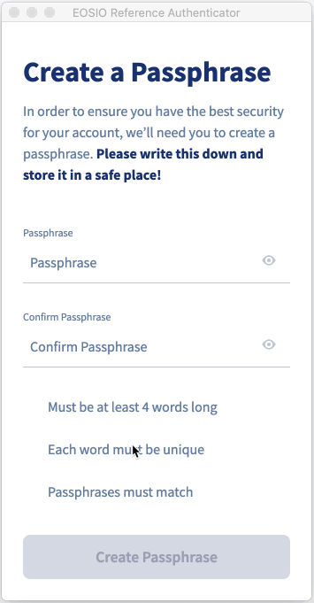
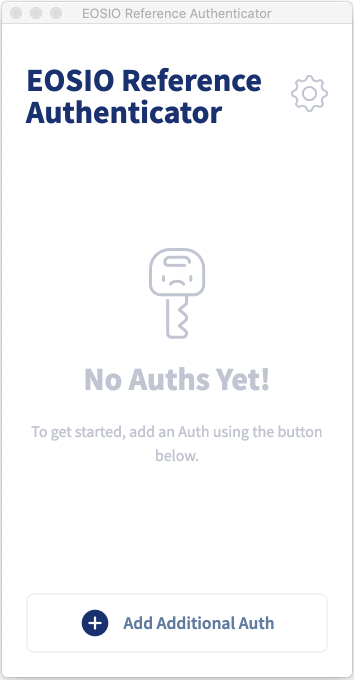
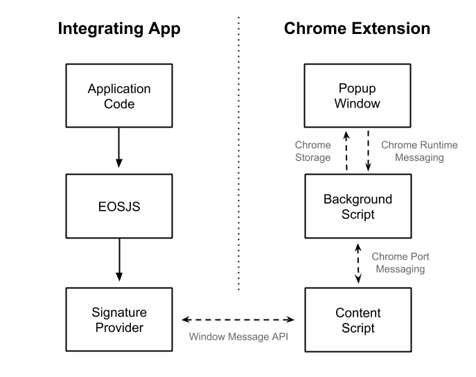

# EOSIO Reference Chrome Extension Authenticator App <!-- omit in toc -->
A Chrome extension which demonstrates how users could sign transactions from EOSIO apps using various EOSIO labs tools.


## About EOSIO Labs <!-- omit in toc -->

EOSIO Labs repositories are experimental.  Developers in the community are encouraged to use EOSIO Labs repositories as the basis for code and concepts to incorporate into their applications. Community members are also welcome to contribute and further develop these repositories. Since these repositories are not supported by Block.one, we may not provide responses to issue reports, pull requests, updates to functionality, or other requests from the community, and we encourage the community to take responsibility for these.

## Overview <!-- omit in toc -->
The EOSIO ecosystem is rich with existing wallets providing users the ability to sign transactions on the EOSIO blockchain. However, we have identified some limitations and possible areas for improvement to the overall user experience:
* Providing support for only Mainnet accounts and transactions.
* Lack of support for displaying Ricardian Contracts.
* Lack of transparency and verification of application's identity and intentions, especially during transaction signing.

This Reference Implementation serves an example for wallet developers as possible solutions to the problems stated above from the Chrome desktop browser. The Chrome extension provides the following as reference:

* It provides seamless multi-network support.
* It securely stores private keys and signs transactions, showing a richly formatted [Ricardian Contract](https://github.com/EOSIO/ricardian-spec), which provide users with a human readable explanation of the action(s) the app is proposing and allows them to accept the contract’s terms.
* By following the [Manifest Specification](https://github.com/EOSIO/manifest-spec), it shows metadata about apps to end users as they are signing transactions, which provides users with a better sense of trust for the app they are interacting with. It also runs various transaction pre-flight security checks comparing the contents of a transaction request with what apps have declared about themselves.

## Table of Contents <!-- omit in toc -->
- [Required Tools](#Required-Tools)
- [Installation](#Installation)
- [Integrating with Apps](#Integrating-with-Apps)
- [Getting Started with an Example Web App](#Getting-Started-with-an-Example-Web-App)
- [Usage](#Usage)
  - [How to Create a Passphrase](#How-to-Create-a-Passphrase)
  - [How to Add a Private Key](#How-to-Add-a-Private-Key)
  - [How to Accept a Selective Disclosure Request](#How-to-Accept-a-Selective-Disclosure-Request)
  - [How to Sign Transactions](#How-to-Sign-Transactions)
- [Architecture](#Architecture)
  - [Data Flow](#Data-Flow)
  - [Data storage](#Data-storage)
  - [Storage Listeners](#Storage-Listeners)
  - [Web Workers](#Web-Workers)
  - [Manifest Specification](#Manifest-Specification)
    - [Assert Action](#Assert-Action)
  - [Security](#Security)
  - [Insecure Mode](#Insecure-Mode)
      - [Chrome extension](#Chrome-extension)
      - [Application](#Application)
- [Contributing](#Contributing)
- [License](#License)
- [Important](#Important)

## Required Tools

* [Yarn](https://yarnpkg.com/lang/en/) with support at `^1.15.2` (latest stable).
* [Node.js](https://nodejs.org/en/) with support at `^10.15.3` LTS. **NOTICE** This project will not build on the current version of Node.js `12.3.1` due to an error in a sub-dependency of `react-scripts`.

## Installation
1. Install dependencies and build the extension.
```bash
yarn install
yarn build
```

2. Install the extension in your browser by following step 2 [here](https://support.google.com/chrome/a/answer/2714278?hl=en) and select the `build` folder.

## Integrating with Apps
The Chrome extension follows the [EOSIO Authentication Transport Protocol Specification](https://github.com/EOSIO/eosio-authentication-transport-protocol-spec). There is some configuration needed in the integrating app, and there are a few different ways to interact with the Chrome extension from an integrating app:
1. Make sure your app follows the [Manifest Specification v0.7.0](https://github.com/EOSIO/manifest-spec/tree/v0.7.0).
1. Make sure your application's Ricardian Contracts follow the [Ricardian Specification v0.2.0](https://github.com/EOSIO/ricardian-spec/tree/v0.2.0).
1. Choose a solution for interacting with the Chrome extension:
   1. (Easiest) Use the [Universal Authenticator Library](https://github.com/EOSIO/universal-authenticator-library).
      - UAL with the [EOSIO Reference Authenticator](https://github.com/EOSIO/ual-eosio-reference-authenticator) will detect if the Chrome extension is installed, and allows for easy integration. Read the documentation on the [Tropical example app](https://github.com/EOSIO/tropical-example-web-app) to learn how to use UAL.
   1. Use the [EOSJS Signature Provider for desktop browsers](https://github.com/EOSIO/eosjs-window-message-signature-provider-interface).
      - This class implements the [EOSJS Signature Provider interface](https://github.com/EOSIO/eosjs-signature-provider-interface). The documentation describes how to utilize it directly with EOSJS.
   1. Directly use the [Window Messaging API](https://developer.mozilla.org/en-US/docs/Web/API/Window/postMessage).
      - The integrating app will need to post requests and listen for responses following the [EOSIO Authentication Transport Protocol Specification's](https://github.com/EOSIO/eosio-authentication-transport-protocol-spec) envelope formats.

## Getting Started with an Example Web App
If you want to start out by test driving the EOSIO Reference Chrome Extension Authenticator App for yourself, we recommend checking out our [Tropical Example web app](https://github.com/EOSIO/tropical-example-web-app/). Tropical Example is a mock web application for renting properties and provides instructions and a script for setting up a local chain bootstrapped with all of the necessary, compliant contracts for making the experience work.

Specifically, follow the instructions under the [Running Tropical Example](https://github.com/EOSIO/tropical-example-web-app/#running-tropical-example) header. (Of course, we recommend reading the rest of the README there too, which will provide more context around how the pieces work together to provide the user with a secure and positive user experience.)

## Usage
* [Create a Passphrase](#how-to-create-a-passphrase)
* [Add a Private Key](#how-to-add-a-private-key)
* [Accept a Selective Disclosure Request](#how-to-accept-a-selective-disclosure-request)
* [Sign Transactions](#how-to-sign-transactions)

### How to Create a Passphrase
1. Start the extension by clicking on the extension icon in the far right corner of the Chrome browser.
1. You should be immediately be prompted to create a passphrase if you have not already done so.
1. A passphrase must adhere to the following requirements:
   1. Must be at least 4 unique words, ex: `hello my name is`.
   1. :warning: You will not be able to recover your passphrase, if forgotten, because the passphrase is never stored, so be sure to securely store your passphrase :warning:.
1. You will be prompted to enter your passphrase twice for confirmation.



### How to Add a Private Key
1. After you have set a passphrase, clicking on the extension icon will open the Auths page by default.
1. Click on the "Add Additional Auth" button.
1. Enter the private key, a nickname that will be publicly displayed, and your passphrase.
1. Click the "Save" button.
1. If successful, you should now see the Auth added to the Auths list with the nickname you provided.



### How to Accept a Selective Disclosure Request
1. From an app that supports integration with the Chrome extension, attempt to login.
1. The Chrome extension will open a window with a Selective Disclosure request. You can either accept or deny this request.
1. If the request is accepted, the requesting app will be returned the public keys associated with your current Auths.

### How to Sign Transactions
1. From an app that supports integration with the Chrome extension, attempt to execute an action that requires a signature.
1. The Chrome extension will open a window with the transaction request, including the Ricardian Contracts of the actions. You can either accept or cancel this request.
1. If the request is accepted, the Chrome extension will prompt for your passphrase.
1. If the passphrase is correct, the Chrome extension will generate a signature, which will be returned to the requesting app.


## Architecture
### Data Flow


The data flow in the Chrome extension is unfortunately not straight-forward. Ultimately, integrating apps interact with the Chrome extension through the [window messaging API](https://developer.mozilla.org/en-US/docs/Web/API/Window/postMessage). Internally, the Chrome extension uses various means of sending data between different parts of the extension. Here is an explanation of the data flow:

1. The integrating app sends a message (e.g. requesting public keys) over the [window messaging API](https://developer.mozilla.org/en-US/docs/Web/API/Window/postMessage). This message is received by the Chrome extension's [content script](https://developer.chrome.com/extensions/content_scripts) via the same API.
1. Since the content script runs in the context of the web page, it must forward the messages to the [background script](https://developer.chrome.com/extensions/background_pages). To do this, it uses [Chrome port messaging](https://developer.chrome.com/extensions/messaging#connect).
1. The background script is in charge of creating the extension window which holds the main user-facing UI of the Chrome extension. Instantiating the window is an asynchronous action, and the background script needs to send data to the extension window. For this, the background script stores data that the extension window needs in [Chrome storage](https://developer.chrome.com/extensions/storage). Once the extension window is instantiated, it retrieves the data from Chrome storage and then clears the storage.
1. When the extension window is ready to send a response to the integrating app, it must also go through multiple steps. The extension window sends a message back to the background script via [Chrome runtime messaging](https://developer.chrome.com/extensions/messaging#simple).
1. The path back to the integrating app is now similar to before. The background script sends the response to the content script through Chrome port messaging, which sends the response back to the integrating app over the window messaging API.

### Data storage
The Chrome extension uses the [Chrome storage](https://developer.chrome.com/extensions/storage) API for storing data. It uses both `sync` and `local` storage for different things. The only difference between `sync` and `local` storage is that `sync` storage is synced across your Chrome browsers on different devices, and can store significantly less data.
1. `sync` storage is used for storing Auths (encrypted private keys) and the user's hashed passphrase.
   - On first use, a user chooses a passphrase which will be used to encrypt private keys. A hashed version of the passphrase is stored to later check for a correct passphrase. The non-hashed version of the passphrase is _never_ stored.
   - All private keys are encrypted before storage with the passphrase chosen by the user.
1. `local` storage is used as a buffer to move data from the background script to the extension window, as described in the [Data Flow](#data-flow) section above. It also stores developer settings such as the [insecure mode settings](https://github.com/EOSIO/eosio-reference-chrome-extension-authenticator-app#insecure-mode).

### Storage Listeners
The main extension window and the settings page are separate React apps, so changes to the state of one doesn't automatically propagate to the other. Because of this, the states of the React apps need to update when the Chrome storage changes. This is done by adding listeners to the [onChanged event on Chrome storage](https://developer.chrome.com/extensions/storage#event-onChanged). Here is a quick explanation:
1. On instantiation of either the extension window or the settings page, the app's initial state (in our case, handled by [Redux](https://redux.js.org/)) is set from the data in Chrome storage.
1. Listeners are added to the `onChanged` event on Chrome storage, which update the Redux store when changes happen to Chrome storage.
1. When a user makes a change such as updating their passphrase or adding an Auth, the change is also set in Chrome storage. This causes the event listeners to update the state of other open React apps.

### Web Workers
The Chrome extension uses the [Web Workers](https://developer.mozilla.org/en-US/docs/Web/API/Web_Workers_API/Using_web_workers) API for encrypting and decrypting keys. Web workers run scripts in background threads without interfering with the UI. Encryption and decryption rely on CPU intensive operations which hang up the extension UI. This performance hit is especially noticeable when users have several keys imported and they are updating the passphrase used to encrypt those keys. The keys need to all be decrypted with the old passphrase and then re-encrypted with the new passphrase, resulting in a frozen UI for several seconds. Using the web workers API allows the UI to continue functioning while encryption and decryption runs in a background thread.

### Manifest Specification
The Chrome extension adheres to the [Manifest Specification](https://github.com/EOSIO/manifest-spec).
All [checks](https://github.com/EOSIO/manifest-spec#how-it-works) described in the Manifest Specification are validated in the Chrome Extension.

#### Assert Action
As part of the Manifest Specification, the Chrome extension will generate a [`eosio.assert::require` action](https://github.com/EOSIO/eosio-reference-chrome-extension-authenticator-app/blob/develop/src/contracts/eosio.assert.abi.json#L52) with the following parameters:
   * `chain_params_hash`: Hash of the chain information from the [Application Metadata](https://github.com/EOSIO/manifest-spec#application-metadata-specification) for the chain defined in the request envelope.
   * `manifest_id`: Hash of the [Manifest](https://github.com/EOSIO/manifest-spec#application-manifest-specification) for the chain defined in the request envelope.
   * `actions`: An array of actions whitelisted in the Manifest.
   * `abi_hashes`: An array of the hashed abis included in the request envelope.

This action, with the above parameters, will be added to the transaction so that the chain can validate that these values match what is registered on chain. If any of these validations fail, the entire transaction will be rolled back and rejected.

### Security
The Chrome extension takes measures to assure users that private keys are securely stored.

1. Passphrases have a basic requirement of at least 4 unique words, ex: `hello my name is`. These requirements should be thoroughly reviewed for a production extension.
1. The created passphrase is hashed with a `sha256` hash function and stored in `sync` storage. Passphrases are then validated by checking the `sha256` of the provided passphrase making them **NON-RECOVERABLE** since they are never stored.
1. When private keys are added to the Chrome extension they are encrypted with the passphrase using the [bip38](http://cryptocoinjs.com/modules/currency/bip38/) encryption library. The Chrome extension uses an encryption iteration of 512. This iteration value is lower than the recommended value of 16384 due to performance constraints.

### Insecure Mode
The Chrome extension has a developer settings page that allows application developers to enable `insecure mode` in order to bypass Manifest Specification security measures for development purposes only. Turning off security measures could lead to **DISASTROUS** results. :warning: ***USE THIS FEATURE WITH CAUTION***. :warning:

To enable `insecure mode` follow the steps below for both the Chrome extension and the application being developed.

##### Chrome extension
1. To enable `insecure mode` open the Chrome extension and click on the settings cog icon in the upper right-hand corner.
1. Click the Developer tab on the left sidebar menu.
1. Toggle "Insecure Mode" on.
1. Enter the application URL in the input field and click the "Save" button.

##### Application
The integrating application must add the [securityExclusions](https://github.com/EOSIO/eosio-authentication-transport-protocol-spec#securityexclusions-optional) options to the [Request Envelope](https://github.com/EOSIO/eosio-authentication-transport-protocol-spec#request-envelope) as part of the [EOSIO Authentication Transport Protocol Specification](https://github.com/EOSIO/eosio-authentication-transport-protocol-spec).

## Contributing

[Contributing Guide](./CONTRIBUTING.md)

[Code of Conduct](./CONTRIBUTING.md#conduct)

## License

[MIT](./LICENSE)

## Important

See LICENSE for copyright and license terms.  Block.one makes its contribution on a voluntary basis as a member of the EOSIO community and is not responsible for ensuring the overall performance of the software or any related applications.  We make no representation, warranty, guarantee or undertaking in respect of the software or any related documentation, whether expressed or implied, including but not limited to the warranties of merchantability, fitness for a particular purpose and noninfringement. In no event shall we be liable for any claim, damages or other liability, whether in an action of contract, tort or otherwise, arising from, out of or in connection with the software or documentation or the use or other dealings in the software or documentation. Any test results or performance figures are indicative and will not reflect performance under all conditions.  Any reference to any third party or third-party product, service or other resource is not an endorsement or recommendation by Block.one.  We are not responsible, and disclaim any and all responsibility and liability, for your use of or reliance on any of these resources. Third-party resources may be updated, changed or terminated at any time, so the information here may be out of date or inaccurate.  Any person using or offering this software in connection with providing software, goods or services to third parties shall advise such third parties of these license terms, disclaimers and exclusions of liability.  Block.one, EOSIO, EOSIO Labs, EOS, the heptahedron and associated logos are trademarks of Block.one.

Wallets and related components are complex software that require the highest levels of security.  If incorrectly built or used, they may compromise users’ private keys and digital assets. Wallet applications and related components should undergo thorough security evaluations before being used.  Only experienced developers should work with this software.
